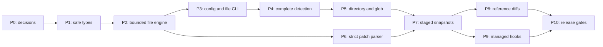

# rayloc implementation plan

Prepared on 2026-10-01 after reading the complete [README](../README.md),
[technical design](../technical-design.md), [design validation report](research/technical-design-validation.md),
and [agent instructions](../AGENTS.md), and inspecting every source module.

Build the scanner in dependency order: safe reporting and bounded file detection,
configuration and detection completeness, directory/glob scope, staged Git
enforcement, reference diffs, then hook installation and release validation.
Each package below has a concrete completion gate and can become a focused PR.
The work packages describe v1 contracts; partial implementation does not close a
package's completion gate.

## Current progress — 2026-10-03

P3 is complete at `ebc63d2` after implementation, required verification, and an
independent review/fix/re-review cycle in `feat/rayloc-v1`. P4 is complete at `7a5185e`;
P5 is complete at `e31e715`; P6 is complete at `39d359f`; P7 is complete at
`e301c0e`. P8 is complete at `1808af7` after independent review and a test
isolation fix. P0–P2
foundation gaps tied to full-scope evaluation remain tracked below rather than
being silently closed by the explicit-file delivery.

| Package | Status | Implemented evidence | Remaining to close the package |
| --- | --- | --- | --- |
| P0 | Partial | [Decision note](development-decisions.md); OS-native CLI parser; bounded YAML/regex policy and validated dependency graph; separate calibration/held-out corpus; temporary-file helpers; coverage gate; local Rust-1.85 checks | Scope/global resource decisions; complete controlled Git helpers; successful native CI run |
| P1 | Partial | Private redaction marker; safe source IDs and fixed errors; byte locations; severity/confidence; scan counters; exit precedence; partial/clean terminal reports; output leak tests | Configuration error boundary; exclusion/suppression counters; final multi-source ordering and safe metadata contracts as policy/scope are added |
| P2 | Partial | Bounded regular-file/byte engine; core provider/PEM rules; CRLF/invalid-byte/buffer-boundary tests; >10 MB streaming and limit tests; executable engine benchmark | Shared custom-regex registry and compiler budgets (deferred to P3); broader resource measurements and fixture evaluation |
| P3 | Complete | Strict bounded configuration/merge, compiled custom captures/entropy, file exclusions and CLI; fail-closed discovery; 59 stable/MSRV tests; independent re-review approved | — |
| P4 | Complete | Context/password/JOSE/suppression detection; review fixes at `7a5185e`; 88 Rust tests +2 evaluator; coverage gates; independent re-review approved | One non-blocking opaque-token span minor recorded for final review |
| P5 | Complete | Directory/glob policy, bounded parallel scanning, deterministic global collection and measured crossover/RSS; 139 tests on current Git, Git 2.30 and Rust 1.85; independent review fixes approved | Two non-blocking minors recorded for final review |
| P6 | Complete | Pure bounded raw-binding/unified-patch parser; adversarial byte/count tests; hunk-gap review fix at `39d359f`; 158 tests and coverage gates; independent re-review approved | P8 working-tree unknown-OID handoff recorded |
| P7 | Complete | Pinned staged index acquisition/policy and added-line CLI; nested-root policy review fix at `e301c0e`; 196 tests current Git/Git 2.30/Rust 1.85; independent re-review approved | Staged latency and platform runs remain P10 gates |
| P8 | Complete | Pinned reference-to-working-tree diff CLI, independent identities, dirty-gitlink exclusion and test-isolation review fix at `1808af7`; 226 tests on current Git/Git 2.30/Rust 1.85; independent re-review approved | Concurrent full-suite TempDir collision carried to P10 runner validation |
| P9 | In progress; paused | Uncommitted installer, CLI tests, Rust-language pre-commit manifest and consumer guide; agent reported direct-hook integration tests green | Finish framework installation/commit tests, required checks, commit, independent review and any fixes |
| P10 | Not started | — | Full evaluation, supported-platform artifacts, and release gates |

Verified locally for `923400b`: all 26 tests pass; production function coverage
40/40 (100%), line coverage 402/402 (100%), and region coverage 571/573 (99.65%).
Format, strict Clippy, tests, benchmark, and the coverage gate passed on Rust
1.88.0. The stable/Rust-1.85 CI workflow is configured but has not yet been verified
on GitHub; Rust 1.85 is not installed locally. The small warm engine benchmark is
a development baseline, not evidence for the complete v1 performance targets.

Verified P3 final checks at `ebc63d2`: 59 tests pass on local stable and Rust
1.85; production function coverage is 99/99 (100%), lines 1065/1072 (99.35%),
and regions 1718/1751 (98.12%). Formatting, strict Clippy, benchmark and diff
checks pass. The independent reviewer approved both discovery failure handling
and the portable Unix output-error fixture. Native CI/full v1 evaluation remain open.

**Work paused at user request.** On resumption, finish and review P9, then P10.
Explicit-file,
directory, glob, staged, and reference-diff scans are available; hook mode remains
unavailable pending P9. Package sub-agent evidence is
summarized in [the implementation report](implementation-report.md).
Update this table and package status lines whenever implementation advances.

User policy decisions and the remaining confirmation questions are tracked in
[development decisions](development-decisions.md#user-decisions--2026-10-02).
Q1 (justified dependencies), Q2 (restricted YAML), Q3 (merge explicit configuration
over discovery while retaining repository `.raylocignore`), and Q4 (safe numeric
report metadata) are confirmed. Q6–Q10 are also confirmed: ignore-file priority
without generated-directory defaults, excluded-glob success with scope reporting,
installation in Git's active hooks directory plus pre-commit framework support,
Linux/macOS targets, and preparation of archives plus crates.io. Q5 is confirmed:
standalone entropy detection is deferred from v1;
engineering validation gates remain open.

## 1. Repository discovery

At initial discovery, the repository was a scaffold. `src/cli.rs` handled
help/version and returned 2 for scan/hook commands. Other modules contained
declarations and comments only. `Cargo.toml` had no dependencies, declared Rust
1.85 and edition 2024, and disabled publishing. There were no integration tests,
fixture corpus, scanning benchmarks, or CI workflows. Configuration and ignore
files were templates.

The required format, Clippy, test, and benchmark commands passed during this
discovery on Rust/Cargo 1.88.0 and Git 2.55.0. Both test and benchmark harnesses
ran zero tests. Rust 1.85 is not installed locally, so MSRV compatibility has
not been exercised. These checks establish scaffold health only.

| Area | Initial gap to close | Implementation package |
| --- | --- | --- |
| Safety and errors | No redacted value, safe metadata, typed errors, or partial-scan report | P1 |
| File scanning | No bounded byte reader, locations, regex registry, or provider detection | P2 |
| CLI/configuration | No target validation, YAML loader, custom rules, or policy discovery | P0, P3 |
| Detection completeness | No assignment lexer, entropy/password branches, JOSE, exclusions, or deduplication | P4 |
| Directory/glob scans | No tracked/untracked distinction, ignore policy, bounded traversal, or Rayon pool | P5 |
| Git diff scanning | No acquisition layer, snapshot, strict parser, or reference semantics | P6–P8 |
| Hooks | No active-hook resolution, managed installation, or existing-hook protection | P9 |
| Evaluation/release | No measured accuracy/latency/RSS, platform matrix, or distribution artifacts | Starts P2; release gate P10 |

Two existing policies matter when building tests. `.gitignore` excludes untracked
`.env` files, while the design keeps tracked and explicitly selected `.env` files
eligible. `.raylocignore` explicitly excludes `tests/fixtures/**`, `target/`,
`node_modules/`, and `vendor/`; those scanner exclusions also apply to tracked
paths. Use isolated temporary test repositories and deliberate test policy so
fixtures cannot accidentally produce successful zero-coverage scans.

## 2. Decisions before implementation

P0 resolves the following choices and records the result in a short dependency
and contract decision note. Preserve Rust 1.85 unless a separate change explicitly
revises the supported-toolchain promise.

| Decision | Recommended approach | Evidence needed to close it |
| --- | --- | --- |
| YAML parser | Evaluate a maintained Rust-1.85-compatible parser with a bounded adapter. Treat current `serde-saphyr` as incompatible with the declared MSRV. | Compile the selected dependency graph on 1.85; exercise duplicate keys, depth, event/alias limits, and safe diagnostics. |
| CLI parser | Start by evaluating the existing `args_os` parser against the small v1 command surface; choose Clap if its validation/maintenance benefit justifies startup and binary cost. | The same argument matrix passes; neither implementation echoes sensitive arguments in failures. |
| Regex budgets | Limit individual extractors, the combined set, and the aggregate registry, including compilation work. | Adversarial configuration fits a documented memory/time envelope or fails with 2. |
| Scope bookkeeping | Use bounded batches and, where necessary, disk-backed metadata; avoid an eager repository-wide path map. | Track/deduplicate many tiny files and associate Git metadata with patch sections under bounded RSS. |
| Finding overflow | Keep a deterministic bounded selection by the final sort key and mark overflow incomplete. | Serial and parallel overflow tests retain the same findings, stay within the global limit, and return 2. |
| Report metadata | Escape terminal controls, detect sensitive metadata where possible, and fall back to stable source/rule numbers when safe display cannot be established. | Credentials embedded in paths, labels, regex errors, and child diagnostics never appear in output. |
| Policy override | Define explicit `--config` as caller-selected policy; discovered staged policy comes from the index tree. Document the provenance in help/design. | Unstaged edits cannot alter discovered staged policy; an explicit external CI configuration has predictable precedence. |
| Git/platform support | Implement/test on available Linux first; establish minimum Git and supported OS/architecture combinations before distribution. | CI runs the required commands and Git edge cases on every advertised platform/version. |

A concrete parser finding from this discovery: the published `serde-saphyr`
1.3.0 manifest requires Rust 1.89, exceeding both rayloc's MSRV and the locally
installed compiler. [Published manifest](https://docs.rs/crate/serde-saphyr/latest/source/Cargo.toml).
`yaml-rust2` 0.13.0 declares Rust 1.85.0 and is a candidate for an event-based
adapter, subject to transitive-dependency and parser-limit tests.
[Published manifest](https://docs.rs/crate/yaml-rust2/latest/source/Cargo.toml).
Its project describes basic maintenance and a stable API, which must be weighed
against alternatives. [Project documentation](https://docs.rs/crate/yaml-rust2/0.13.0).
Declared MSRV is evidence for selection, not proof that the complete graph builds.
Do not pin an old parser release solely to bypass the compiler requirement.

Parser selection must explicitly define one-document handling, unknown tags,
merge keys, anchors/aliases, and duplicate keys. If expansion cannot be bounded,
reject the unsupported construct with a documented configuration error. Disable
automatic includes, environment interpolation, and source-snippet diagnostics.
The configuration language must not acquire implicit file/network access.

Prefer short standard-library implementations under the user's dependency rule.
P2 core signatures use static byte recognizers rather than a regex dependency.
Evaluate a justified regex dependency for P3 custom patterns and a bounded YAML
implementation against the full grammar. Evaluate scanner path policy in P3,
Base64/JSON support in P4, and glob support in P5 before adding crates. Rayon
remains the planned P5 parallelism backend under the repository contract.
Review features, licenses,
transitive crates, binary size, and the lockfile. Use `std::process::Command`
for Git. `memmap2`, a separate Aho-Corasick router, and `git2` are deferred pending
a measured benefit and their additional safety/build requirements.

## 3. Architecture and shared contracts

Keep the existing module layout. Small additional modules can separate bounded
reading (`scanner/reader.rs`), assignment context (`rules/context.rs`), JOSE
checks (`rules/jose.rs`), Git process acquisition (`scanner/git.rs`), common typed
errors, and hook installation (`hook.rs`). Avoid putting process management,
policy resolution, patch parsing, and detection into one implementation.

| Boundary | Contract |
| --- | --- |
| Scan request | Exactly one of explicit/default path, glob, staged, or resolved reference; policy provenance is explicit. |
| Policy/registry | Validated immutable configuration, compiled rules and path matchers; shared by workers without recompilation. |
| Source record | Internal borrowed bytes, source ID, 1-based line/byte-column location, and contiguous-scope information. Files and added diff lines use the same detector. |
| Candidate/finding | Rule registry index and half-open byte span; any retained target uses private `RedactedString`. Discard bytes when spans/decisions suffice. |
| Detector | Structural/custom and generic/password branches have independent gates. No I/O, terminal output, or network access. |
| Scan outcome | Safe findings, coverage/suppression counters, typed errors, and completeness state. Errors take precedence over findings. |
| Report renderer | Receives safe objects, prints complete masks and fixed advice, omits source lines, and sorts by path bytes/location/rule. |

Initial resource limits follow the design: 256 KiB worker read buffers, 1 MiB
physical lines/diff records and configuration input, 64 KiB candidate/JOSE values,
256 custom rules, 16 KiB pattern text, and 10,000 retained findings globally.
P0 must assign numeric parser, regex, metadata-record, batch/queue, worker, and
aggregate policy limits. A per-worker cap alone is not a global memory budget;
account for worker buffers, line/candidate state, registry, queues, metadata,
and the result collector together. Apply bounded input handling to ignore files
and Git metadata as well as YAML and file content.

Any limit/read/traversal/process/parse failure makes the result incomplete and
returns 2. Successful scope with findings returns 1; successful scope without
findings returns 0. An ignored explicit file reports its exclusion and zero
scanned files. An existing empty directory or empty valid diff succeeds; a glob
with no matching regular-file targets returns 2. Count regular-file glob matches
before policy; matched but all-excluded targets return 0 with an excluded-scope
report, as confirmed in Q7.

## 4. Implementation packages and completion gates



Evaluation begins with P2 and grows with each package. P6 can be developed before directory scanning is
finished; hook installation becomes available only after staged enforcement
passes its complete contract. Each supported command must have corresponding
help/README status; unfinished modes continue to return 2.

### P0 — Resolve feasibility and establish the test environment

**Status:** Partial — decision note, file-test helpers, and CI/coverage tooling exist; parser, scope, Git-test, and validation decisions remain open.

Depends on repository discovery. Produce the decision note described above,
reviewed dependency choices, and a CI workflow covering stable Rust and MSRV
1.85. Create temporary repository/file helpers with synthetic data and controlled
Git configuration so machine-global hooks, attributes, and excludes cannot
change expected results. Define calibration and held-out corpus partitions now.

**Completion:** parser feasibility, budget choices, safe metadata behavior,
CLI choice, and scope bookkeeping are recorded; CI exercises the scaffold;
test helpers are ready before provider/Git fixtures are added. Do not treat
zero-test CI as detection validation.

### P1 — Establish redaction, typed failures, and report boundaries

**Status:** Partial — the library redaction/error/report boundary is tested; policy errors, suppression/exclusion counters, and multi-source reporting remain open.

Depends on P0. Work in `scanner/redaction.rs`, `scanner/mod.rs`, report modules,
and the error/CLI boundary. Add private `RedactedString` with safe `Display` and
`Debug`, location/span types, severity/confidence, coverage counters, and typed
execution/configuration/incomplete-scan errors. Give the renderer safe metadata
only. Implement exit precedence and deterministic reporting with coverage,
suppression counts, and wall time, without source excerpts.

**Completion:** tests cover short, Unicode, invalid-byte, and multiple values;
formatting and both output streams contain no complete detected sentinel.
Sensitive path/label/error metadata and terminal controls are withheld or safely
rendered. Mixed findings/errors return 2 and the report is labeled partial.

### P2 — Implement bounded file reading and core structural rules

**Status:** Partial — the bounded core engine and provider rules are tested; custom regex compilation moves to P3 and broader evaluation remains open.

Depends on P1. Work in the reader, `scanner/engine.rs`, and rule modules. Scan
regular files as bytes with bounded physical-line assembly across read-buffer
boundaries. Preserve CRLF, missing final newline, offsets, and line numbers.
Use buffered reads for mutable workspace files, including those exceeding 10 MB.
Reject oversized records/candidates without returning clean.

Core built-ins now use static byte recognizers, as recorded in the decision note.
The shared custom byte `RegexSet` and individual extractors, with identical flags
and one-time compilation, are deferred to P3 policy loading. Reject empty-match
custom rules and enforce compiler budgets there. Add AWS
access key IDs, GitHub opaque prefixes, Stripe secret/restricted test/live keys,
Slack/GovSlack webhooks, and the private-key marker variants. Each rule gets
explicit boundaries, secret capture, severity/confidence, dated provider
references, and positive/negative synthetic fixtures. Rules inspect whole lines,
including invalid UTF-8 and NUL-containing content.

**Completion:** engine tests detect every mandatory supported fixture and reject
the specified negatives, including non-key AWS IAM IDs, publishable Stripe keys,
and public-key/certificate headers. A match spanning a read-buffer boundary is
found once at the right position. Large-file/giant-line tests demonstrate bounded
memory and failure behavior. Introduce executable engine benchmarks rather than
leaving `cargo bench` as an empty release test harness. Keep public file scanning
behind P3 so discovered policy cannot be silently ignored.

### P3 — Load strict policy and expose the explicit-file CLI

**Status:** Complete — `f0729c4` implementation plus `ebc63d2` review fixes. Required checks and actual Rust-1.85 tests pass; independent scoped re-review approved with no open findings.

Depends on P2 and the P0 parser decision. Work in `config/mod.rs`, `rules/mod.rs`,
`rules/entropy.rs`, CLI/report modules, and explicit-file scanner exclusions. Discover repository-root
policy through Git, or the selected path's directory outside Git. Implement
`--config` precedence, schema version `"1"`, existing README fields, custom-rule
addition, `disabled_rules`, `secret_group`, and class entropy overrides.
Validate unknown/duplicate fields and IDs, captures, severities, finite thresholds,
pattern sizes, empty matches, and provably unreachable entropy gates. Missing
optional captures do not create findings; multiline custom matching is unsupported.
Implement the reusable 256-bin entropy histogram with `f64` comparison and apply
optional custom gates only to captured secret bytes.

Resolve target conflicts using OS-native arguments without echoing raw input.
Connect `rayloc scan <file>` to the complete safe outcome/report flow. Apply
root `.raylocignore` to explicit files; Git ignores do not override explicit
selection. Do not introduce generated-directory defaults. Reject explicit
symlinks/non-regular files.

**Completion:** the explicit-file command demonstrates exits 0/1/2, safe custom
findings, entropy on the captured value only, and counted exclusions. Invalid or
resource-exhausting configuration fails before workers/readers begin. The supplied
configuration template loads successfully. Help/version behavior remains intact;
unsupported target modes remain unavailable until their packages pass.

### P4 — Add context, entropy, scoped suppression, and JOSE coverage

**Status:** Complete — `cda4344` plus `7a5185e` fixes; independent re-review approved. 88 Rust tests and 2 evaluator tests pass, actual Rust1.85 and required checks pass; functions100%, lines98.9910%, regions98.0769%. One non-blocking span minor is recorded for final review.

Depends on P3. Work in entropy/context/JOSE modules and the registry. Reuse the
entropy primitive and add alphabet precedence and the design's provisional class
thresholds/length caps. Explicit custom entropy
gates remain independent. Add the small assignment/header lexer for `.env`,
YAML/JSON pairs, common code literals, escaped quotes, normalized snake/camel
names, and `Authorization: Bearer` values. Context state never crosses unrelated
files or noncontiguous added-line runs.

Add AWS secret-access-key assignment detection, generic context-associated
values of at least 16 bytes, and concrete strong password assignments of at
least 8 bytes without requiring entropy. Recognize environment/config references.
Default standalone entropy detection remains off; if an opt-in flag is exposed,
name and document it in the configuration/CLI contract before enabling it.

Implement bounded three-segment JWS/unsecured JWT and five-segment JWE checks,
Base64url decoding, and protected-header JSON validation. Cover the GitHub
`ghs_APPID_JWT` form and redact the complete provider token. Avoid signature
verification, expiry suppression, and claims of live credential validity.

Add exact/scoped placeholders, checksum-context exclusions, trailing inline
directives outside strings, `--no-inline-ignores`, and counters for suppressions.
Deduplicate identical spans, preferring provider evidence while retaining
distinct occurrences. Generic homogeneity filters must not remove passwords
or structural signatures.

**Completion:** mandatory fixtures cover low-entropy passwords, short random/hex
keys, checksum-versus-key context, escapes, directives inside strings, unpadded
JOSE, unsecured empty signatures, JWE, malformed tokens, and candidate limits.
Produce the first accuracy baseline with separately held-out data; retain
thresholds as provisional until those results justify changes.

### P5 — Implement reproducible directory/glob scope and parallel scanning

**Status:** Complete — `9a7012b` plus `e31e715` review fixes; independent re-review approved. 139 tests pass on current Git, Git 2.30, and Rust 1.85; functions 100%, lines 98.9103%, regions 98.0193%. Two non-blocking minors are recorded for final review.

Depends on P4. Work in `config/ignore.rs`, scanner engine/controller, and CLI.
Implement recursive directory and repository-relative glob modes, brace
alternatives, omitted-target current-directory scans, hidden-file inclusion,
and scanner ignore anchoring/order/negation semantics. Exclude Git administration,
do not follow symlinks, and count recursive non-regular exclusions.

Tracked files remain eligible despite Git ignores. Apply nested repository
`.gitignore` only to discovered untracked
paths; outside Git it acts as scanner exclusion policy. Disable global Git
ignores, `.git/info/exclude`, unrelated `.ignore`, and outside-root parent policy.
Use a bounded union/deduplication strategy for tracked metadata and discovery;
do not collect all paths to recover this distinction. Scanner exclusions retain
precedence in every mode: `.gitignore` first, then higher-priority `.raylocignore`.
Do not automatically exclude generated/dependency directories; use ignore files.
Count regular-file glob matches before policy; all-excluded matches return 0
with excluded-scope reporting, while no regular-file matches returns 2.

Use one bounded Rayon pool for discovery/scanning, bounded work batches,
worker-local reusable buffers/counters, and a serial small-input path. Merge
safe results into the global bounded deterministic collector and sort final
output. Traversal/read failures produce an incomplete result even alongside
findings.

**Completion:** test hidden/tracked/explicit `.env`, forced tracked ignored paths,
nested ignores, negation and pruned parents, ignore-source priority, lockfile coverage,
glob conflicts/no matches, symlinks, permission failures, and many tiny files.
Serial and parallel findings/counters agree; ordering and capped findings do not
depend on worker scheduling. Measure directory throughput/RSS and the serial
crossover before selecting a default parallelism threshold.

### P6 — Build and validate the strict unified-patch parser

**Status:** Complete — `94d0588` plus `39d359f` review fix; independent re-review approved. 158 tests pass on Rust 1.85; functions 100%, lines 98.9600%, regions 98.1840%.

Depends on P2; can precede P5. Keep parsing independent of Git invocation in
`scanner/diff.rs`. Accept bounded byte records and authoritative NUL-metadata
bindings. Decode Git C-quoted paths without whitespace splitting and preserve
non-UTF-8 pathname bytes on supported platforms.

Implement section/hunk state, omitted and zero counts, checked arithmetic,
old/new count validation, context/deletion consumption, and no-final-newline
markers. Only added payload becomes detector input, with new-side coordinates.
Header-like added content remains content. Reject malformed/combined patches,
unbound/mismatched paths, unsupported transitions, and truncated EOF. Reset
context state across noncontiguous added records and hunk/file boundaries.

**Completion:** focused parser tests cover the patch-format cases enumerated in
technical-design section 9. Add bounded adversarial/property tests for parser
state/count failures; retained findings never originate from deleted/context
lines. Parser tests run without Git so acquisition failures cannot hide bugs.

### P7 — Acquire an index snapshot and enable staged scanning

**Status:** Complete — `f3e1c29` plus `e301c0e` review fix; independent re-review approved. 196 tests pass on current Git, Git 2.30 and Rust 1.85; functions 100%, lines 98.9253%, regions 98.0687%.

Depends on P3–P6. Add the Git process layer with argument arrays, bounded stdout
records, concurrent bounded stderr draining/discard, successful-child checks,
and guaranteed process cleanup on early scanner errors. Never forward Git stderr.
Resolve repository/worktree/index through Git and honor `GIT_INDEX_FILE`.

Use `git write-tree` to pin the index tree; resolve HEAD's tree or create an empty
tree for unborn HEAD without assuming SHA-1. Read discovered configuration and
scanner policy from that same snapshot. Reject unmerged entries and detectable
HEAD/index mutation. Acquire authoritative raw NUL metadata and patches with
identical pinned endpoints and all explicit flags in technical-design section 4,
including `--text`, disabled helpers/textconv/renames, and controlled quoting.
Associate them with bounded bookkeeping selected in P0.

Feed only parsed additions to the common detector. Staged findings never reread
working-tree files. Scan symlink link text, count submodule gitlinks as excluded,
and document deletion/addition handling for renames and diff-only PEM limitations.

**Completion:** real temporary-repository tests cover unborn HEAD, partial staging,
unstaged policy edits, ignored force-added files, binary attributes/NUL payload,
quoted/non-UTF-8 paths, rename/delete cases, alternate index, linked worktrees,
unmerged entries, mutation, and child failures. `scan --staged` returns 0 for an
empty valid diff, 1 for staged additions, and 2 for incomplete acquisition. A
secret found only in unstaged replacement content is never reported by this mode.

### P8 — Enable tracked working-tree diffs against a pinned reference

**Status:** Complete — `5b5ebd6` plus `1808af7` test-isolation review fix; independent re-review approved. 226 tests pass on current Git, Git 2.30, and Rust 1.85; functions 100%, lines 98.9939%, regions 98.0313%. Formatting, strict Clippy and benchmarks pass.

Depends on P7. Resolve the supplied reference as a commit using
`git rev-parse --verify --end-of-options <ref>^{commit}` with argument arrays;
never interpret it as an option or shell program. Reuse acquisition/parser logic
for the direct pinned-commit-to-working-tree comparison. Read working-tree policy.
Check for detectable mutation and metadata/patch disagreement.

**Completion:** `scan --diff main` includes tracked staged and unstaged additions,
excludes untracked/deleted/context content, and uses working-tree line numbers.
Invalid/option-like refs, process errors, and detectable mutations return safe
exit 2. Tests distinguish direct-reference comparison from merge-base/history
semantics and cover empty diffs. No claim of an atomic future commit is made.

### P9 — Install a managed pre-commit hook safely

**Status:** In progress; paused at user request. The direct installer, CLI tests, framework manifest and consumer guide have uncommitted changes. Direct-hook integration tests were reported green; framework validation, final verification, commit and independent review remain open.

Depends on P7. Work in `hook.rs`, CLI, and documentation. Resolve the active Git
hook directory, including relative `core.hooksPath` and linked worktrees.
The install command selects Git's active hooks directory, including custom/shared
`core.hooksPath`, without a second opt-in; never write to an inactive destination.
Check scanner discoverability, install atomically with executable permissions,
and use the design's `exec rayloc scan --staged` script.

**Completion:** identical managed installation is idempotent; unmanaged existing
hooks remain intact and return 2 with safe manual-integration guidance. Tests
cover executable permissions, custom/shared paths, missing scanner, and actual
commit status propagation. Findings/errors block the commit. Do not add hook
removal, silent chaining, or overwrite options without separate contracts.
Provide a `.pre-commit-hooks.yaml` Rust-language staged hook and consumer setup
instructions for Python's pre-commit framework. Validate actual installation,
partial staging, empty staged scope, and nonzero-status propagation. Document
the framework's `core.hooksPath` limitation and staged-only manual-run behavior;
see [integration research](research/pre-commit-integration.md).

### P10 — Complete evaluation, packaging, and release readiness

**Status:** Not started.

Depends on P5, P8, and P9; builds on evaluation started in P2. Complete runnable
benchmarks for engine throughput, end-to-end file/directory throughput, and staged
latency including startup, policy, Git, and rendering. Cover empty and
10/100/1,000 added-line diffs at different file counts, >10 MB files, giant lines,
and many tiny files. Record named hardware, CPU/OS/Rust/Git, active rules, threads,
cache state, corpus sizes, median/p95/p99, throughput units, RSS, and binary size.

Report held-out precision/recall and counts by provider/length/context, false
positives per clean MB, and suppression effects. Define wider quality/regression
gates from the measured baseline rather than inventing validated thresholds.
Mandatory supported fixtures require 100% detection and output leak tests require
zero complete detected values. Under-5-ms startup-inclusive latency and
500 MB/s/core remain stretch goals until measured.

Build/test Linux musl and macOS artifacts for the planned x86_64/aarch64 targets,
verifying actual
linkage, naming, CLI behavior, and Git prerequisites on advertised targets.
Prepare checksums and release instructions; keep registry/download claims aligned
with artifacts that actually exist. Prepare both release archives/checksums and
crates.io packaging, including revising `publish = false` when package validation
is ready; actual publication remains a separate release action. Defer Windows.
Update README, templates, test/bench guides, and
the design's remaining decisions to describe shipped behavior and known limits.

**Completion:** all required checks and supported-platform jobs pass, measured
results are reproducible, accuracy/leak/resource gates pass, and artifact smoke
tests succeed. Publishing is a separate release action after review.

### Remaining work to finish P9 and P10

Resume in the existing `feat/rayloc-v1` worktree. Preserve the uncommitted P9
installer, tests, manifest, guide, and framework test script. Direct-hook tests
were reported green before the pause, but P9 has no final verification or review.

**P9 — hook installation and framework integration**

- [ ] Finish the direct installer and test active hook resolution for default,
  relative and absolute `core.hooksPath`, linked worktrees, idempotent executable
  installation, unmanaged-hook preservation, missing scanner, and real commit
  propagation of clean/finding/error statuses on current Git and Git 2.30.
- [ ] Validate `.pre-commit-hooks.yaml` with Python pre-commit and install the
  Rust-language hook from a committed local revision into isolated consumer
  repositories and `PRE_COMMIT_HOME`. Test clean, finding and configuration-error
  commits, partial staging, empty staged scope, index policy, and repeated cached
  execution. Check `pass_filenames: false`, `always_run: true`, and the documented
  `core.hooksPath` and manual `--all-files` limitations.
- [ ] Verify the framework's fresh Cargo installation path on stable Rust and
  Rust 1.85, including dependency resolution without `--locked`. Keep Python a
  developer-side integration, not a rayloc runtime dependency. Run formatting,
  strict Clippy, all tests, benchmarks, and `scripts/coverage.py` with 100%
  function and >98% line/region coverage; commit P9, then independently review
  and fix/re-review any blocking findings.

**P10 — evaluation and release preparation**

- [ ] Measure reproducible end-to-end file, directory, and staged workloads:
  empty and 10/100/1,000 added-line diffs, different file counts, >10 MB files,
  giant lines, and many tiny files. Record hardware, OS/CPU/Rust/Git, rules,
  threads/cache state, corpus sizes, median/p95/p99, throughput, RSS, startup
  latency, and binary size. Treat the 5 ms and 500 MB/s/core targets as stretch
  goals until measured.
- [ ] Extend held-out accuracy and leak evaluation by provider, value length and
  context; report precision/recall, false positives per clean MB, and suppression
  effects. Require detection of every mandatory supported fixture, no complete
  detected value in output, and measured resource limits. Set regression gates
  from these results rather than assumed thresholds.
- [ ] Build and run native artifact/test jobs for Linux x86_64/aarch64 musl and
  macOS x86_64/aarch64. Verify Git prerequisites, actual ELF/Mach-O linkage,
  architecture, executable behavior and extracted-artifact smoke tests. Resolve
  the existing concurrent-suite temporary-directory collision through runner
  isolation or a fixture fix, then verify stable and Rust 1.85 jobs on the exact
  branch commit.
- [ ] Produce versioned archives and a checked SHA-256 manifest. Validate the
  crates.io source package, its contents, locked Rust 1.85 build, dry-run publish,
  and installation from the unpacked package before enabling future publishing.
  Prepare both distribution channels without creating a release or publishing.
- [ ] Update README, templates, development/test guides and remaining design
  decisions to match shipped behavior and measured limits. Run all repository
  checks, review the whole branch and deferred P4/P5 minor findings, fix any
  release-blocking issues, and record passing supported-platform CI evidence.

## 5. Verification and feature traceability

Each implementation package runs the mandatory repository commands:

```sh
cargo fmt --all -- --check
cargo clippy --all-targets --all-features -- -D warnings
cargo test --all
cargo bench
```

The CI workflow now includes locked stable and Rust-1.85 checks; successful CI
execution remains to be verified. Enforce every-function tests and run
`python3 scripts/coverage.py` (>98% line/region coverage, 100% function coverage). Run relevant
fixture/Git/CLI tests within `cargo test --all`; once benchmark programs exist,
keep routine datasets small enough for development and make extended gigabyte/RSS
runs reproducible separately. A benchmark with no detection workload is not
acceptable evidence. Compare results only when scanned scope and enabled rules
are identical.

| User-visible promise | Packages | Required acceptance evidence |
| --- | --- | --- |
| Single-file scanning | P1–P4 | Correct locations, provider/custom/context fixtures, safe report, exits 0/1/2 |
| Directory/glob scanning | P5 | Tracked/untracked ignore matrix, hidden files, bounded discovery, glob errors, deterministic parallel results |
| Staged scanning | P6–P7 | Index bytes/policy, added lines only, partial staging/unborn HEAD and Git failure tests |
| Reference diff scanning | P8 | Direct tracked working-tree comparison, pinned ref, staged+unstaged coverage, no untracked findings |
| Flexible YAML/ignores | P0, P3, P5, P7 | Parser limits, strict schema, capture/threshold precedence, mode-specific policy tests |
| Automatic redaction | P1 onward | stdout/stderr/Display/Debug and sensitive metadata sentinels across every mode/failure path |
| Pre-commit hook | P9 | Existing-hook preservation, active-directory resolution, real commit enforcement |
| Speed/single executable | P2 onward, P10 | Full-workload benchmarks, bounded RSS, dependency/MSRV checks, platform artifact/linkage tests |

## 6. Scope boundaries and first delivery

The first useful delivery is P0–P3: a bounded explicit-file scanner with core
provider/custom rules, strict discovered policy, redacted reports, and complete
failure behavior. P4–P5 complete file/directory/glob detection and scope. P6–P7
deliver the primary pre-commit scanning use case; P8–P10 complete the planned v1.
This sequence follows the design while establishing measurement and leak tests
early enough to influence implementation.

Defer history/merge-base modes, machine-readable reports, archive/UTF-16 decoding,
remote verification, full language parsing, arbitrary multiline custom regexes,
source excerpts, mmap optimization, and extra prefix routing. These require new
contracts or benchmark evidence and are not prerequisites for the README's v1
features. Avoid calendar promises until P0 and the first engine baseline expose
the remaining engineering cost.
