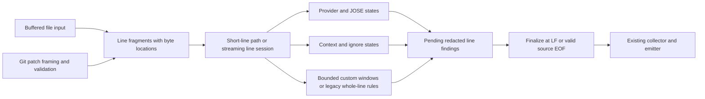

# Bounded byte chunk scanning design

Status: proposal for review; implementation is not authorized by this document.
Source baseline: `c4c8a5f` on `main`, inspected 2026-10-06.

## Purpose and success criteria

Support large text files and minified single-line content without requiring a
buffer as large as the physical line. Preserve fast pre-commit scans, added-only
Git scanning, byte locations, accepted finding IDs, and automatic redaction.
The user also requested an assessment of raising the existing cap to 5 or 10 MB.
Values below use MiB/KiB, consistently with existing powers-of-two constants.

Success means built-ins scan lines of any length, subject to existing candidate,
finding, and counter budgets; results do not depend on how readers split bytes;
ordinary scans meet the performance gate below. Existing custom configurations
remain valid. Custom rules that cannot safely scan bounded windows may return an
explicit incomplete-scan error on long lines. The user confirmed preserving
existing configurations as the compatibility policy.

## Existing behavior and the reason for the limit

`src/scanner/engine.rs` uses a 256 KiB reusable read buffer and assembles each
physical line into a reusable `Vec`, capped at 1 MiB. Detection starts only after
LF or EOF. A longer line returns `ScanError::LineLimit` and exit 2. PR #14,
commit `22101b6`, associates file errors with `SourceError.path`; it did not
introduce the line cap or change matching.

The cap is defensible as an allocation and regex-haystack budget. It also rejects
valid minified inputs and prevents scanning the remainder of an oversized line.
File size itself is already unlimited when individual lines stay within the cap.

Git has two additional constraints: `git::record` caps delimiter-framed input at
1 MiB, and `diff::Parser::record` caps a patch record including LF at 1 MiB.
Changing the file reader alone cannot fix `--staged` or `--diff`.

Whole-line semantics occur in more than one place:

- Inline ignores require an exact trailing comment outside quoted strings.
- The assignment lexer tracks quotes, escapes, separators, and following
  operators; it currently allocates a normalized complete field name.
- Provider and JOSE recognizers require complete token framing and boundaries.
- Custom regexes see an entire physical line, with greedy captures and anchors.
- Built-ins, JOSE, context rules, then configured custom rules determine which
  rule wins when captures have identical spans.

## Upstream evidence and limits of the comparison

The [TruffleHog v3.95.6 release](https://github.com/trufflesecurity/trufflehog/releases/tag/v3.95.6)
lists PR #5022 as fixing scans of lines exceeding the default 64 KB token limit.
The page displays June 18, rather than the July date in the supplied research.
Release notes establish the bug fix, not a general guarantee of unlimited input
or bounded memory. The PR diff was unavailable through the browser during review.

[Gitleaks file acquisition](https://github.com/gitleaks/gitleaks/blob/master/sources/file.go)
starts with 100,000-byte reads and extends fragments toward safe boundaries.
[Betterleaks file acquisition](https://github.com/betterleaks/betterleaks/blob/main/sources/file.go)
uses a similar approach and pooled buffers. These sources support byte-oriented
reading; they do not prove arbitrary regex matches survive every fragment boundary.

[detect-secrets scan code](https://github.com/Yelp/detect-secrets/blob/master/detect_secrets/core/scan.py)
uses `readlines()` when transformations do not supply input. A tool can have no
explicit line cap while still allocating whole lines or files. Entropy thresholds
filter candidates; they do not bound input memory. The KeyHog claim was not
independently verified and is not used to select this design.

## Alternatives, including raising the limit

| Approach | Benefits | Costs and remaining restrictions |
| --- | --- | --- |
| Raise the cap to 5 or 10 MiB | Small change; preserves existing whole-line matching; useful if observed bundles fit | Still rejects longer lines; larger reusable allocations, copies, and regex haystacks; update both Git caps; no speed improvement by itself |
| Split input into fixed windows with a guessed overlap | Bounded buffers; simpler than streaming lexers | Misses matches requiring more overlap; artificial ends can accept truncated tokens; changes anchors, greedy captures, comments, and context |
| Preserve short-line matching and stream long lines with detector state | Bounded working memory; exact built-in token and context boundaries; explicit custom-rule compatibility | More implementation and boundary testing; long-line output waits for LF/EOF |

Recommend the third approach. Raising the limit is a reasonable interim policy
change if 5/10 MiB covers measured user inputs. It is a workaround for the goal
of arbitrary-length lines, although a finite cap can be an intentional final
product policy when documented and measured.

Line buffers grow lazily, not immediately to their cap, and retain capacity
between files in each lane. Worst-case line-plus-read buffer storage is:

| Physical-line cap | 8 active lanes | 32 active lanes | 64 active lanes |
| --- | ---: | ---: | ---: |
| 1 MiB | 10 MiB | 40 MiB | 80 MiB |
| 5 MiB | 42 MiB | 168 MiB | 336 MiB |
| 10 MiB | 82 MiB | 328 MiB | 656 MiB |

These are capacity estimates `(cap + 0.25 MiB) × lanes`, excluding findings,
compiled regexes/caches, thread stacks, lexer allocations, and allocator overhead.
Current automatic threads are capped at eight; explicit requests permit 64.
Admission can use fewer active lanes. A near-cap arbitrary field name can also
allocate normalized/lowercase copies, so the table is not a process RSS ceiling.

Longer regex haystacks add CPU work. Rust's regex engine avoids catastrophic
backtracking, but repeated `captures_iter` searches have a worst-case quadratic
bound in haystack length. A 5×/10× higher cap does not imply that slowdown for
normal patterns, but enlarges the adversarial case. See the
[regex complexity documentation](https://docs.rs/regex/latest/regex/#iterating-over-matches).

## Recommended architecture

Separate acquisition, physical-line lifetime, detection, and finding publication.
Reuse the existing file scheduler and global collector.

### Acquisition and resource budgets

- Retain 256 KiB file read buffers. Internally generated payload fragments are
  at most 256 KiB, even when a supplied `BufRead` exposes a larger slice.
- Buffer short physical lines up to 256 KiB and run existing whole-line matching
  once. When a line grows beyond that, feed the buffered prefix into a persistent
  session exactly once and continue streaming. Reset at every physical line.
- Retain at most 64 KiB per active provider, JOSE, and relevant context candidate;
  use a counter/lookahead byte rather than allocating byte 65,537.
- Provider matching retains at most one 256 KiB input batch plus 128 KiB of
  left/right carry. Custom regex matching uses its separate 256 KiB owned window
  plus 64 KiB right lookahead. Do not retain per-rule copies of either window.
- Allocate legacy whole-line storage only when an enabled rule needs it, capped
  at 1 MiB. Reuse the short-line buffer where possible.
- Raw payload-buffer capacities total at most 1.5 MiB per streaming lane without
  legacy storage and at most 2.25 MiB with it. The conservative totals include
  the independent provider carry, custom regex window, candidate buffers, file
  read buffer, and reusable physical-line/legacy storage. Tiny lexer metadata,
  regex caches, pending redacted findings, and the global collector are
  accounted separately.
- Pending entries are capped at 10,000 per line and keep fixed-size locations,
  rule priority, `FindingId`, and `RedactedString`; no complete secret survives
  candidate evaluation. Use one bounded map keyed by captured span, rather than
  separate unbounded candidate/dedup queues. Record its measured memory cost.

The limit on individual candidate values remains intentional: an ordinary
20 MiB line is supported; a single 20 MiB credential remains outside the
64 KiB candidate contract and must produce exit 2 when its detector recognizes it.

### Locations and physical-line lifetime

Use checked `u64` byte offsets and line numbers internally; convert to public
`usize` columns with checked conversion. Columns stay one-based, half-open byte
columns. Count each byte once, excluding replay/overlap, and each physical line
once. Preserve the current mode-specific convention for LF accounting: file
bytes include LF; Git scanner bytes count only added payload bytes.

LF terminates a line. Keep CR in the payload as current code does. A final
unterminated file line is valid; a partial Git protocol record is invalid.
Empty file input has no line; a file containing LF has one empty line. Fragment
boundaries never count as line endings, comments, token boundaries, or hunk gaps.

### Built-ins and JOSE

Implement incremental framing around existing bounded format validators.
Remember previous-byte boundaries and partial prefixes. Do not accept a provider
token at a fragment end: wait for the actual terminator or line end. Maintain
the existing provider priority and `covered_until` behavior across fragments.
Fixed AWS identifiers need the following byte to validate their boundary.

JOSE must frame the entire compact token including padding and count dots across
fragments before validation. A very long alphanumeric run without two dots is
not automatically a JOSE candidate-limit error. If a run becomes oversized,
retain length/dot state without its raw bytes; if it later meets the JOSE framing
condition, return `CandidateLimit`. Provider framing still independently sees
embedded prefixes as it does today. Disabled rules do not evaluate their limits.

### Context and trailing ignores

Use incremental states for the existing assignment grammar, quote escapes,
Bearer prefixes, whitespace, candidate terminators, and following operators.
Do not generalize to a full JS/JSON parser in this change. Replace normalized
whole-name allocation with bounded classification: exact-name comparisons,
camel/snake transitions, suffix recognition, and checksum component recognition
can be maintained with finite state and short suffix storage. Extremely long
irrelevant names and quoted values must not allocate their complete contents.
Retain relevant candidate bytes only within the existing candidate budget.

An independent directive state preserves the current first-comment, URI `://`,
quote, escape, and exact trailing `rayloc:ignore` behavior. An incomplete quoted
string never manufactures an outside-string directive.

Delay publishing long-line findings until LF/EOF. At finalization, suppress the
entire line if the directive matches; count inline suppression once. Candidate
validation errors retain exit-2 precedence even on an ignored line, matching the
existing pipeline. Keep finding overflow tentative until ignore status is known:
an ignored line must not acquire a finding-limit error from provisional entries.
On read/protocol failure, discard the unfinished line's provisional findings,
retain findings from completed lines, and report an incomplete scan.

For duplicate captured spans, choose the current registry's detector order:
provider built-ins, JOSE, context, then custom configuration order. Resolve this
before accepted-ID filtering or final finding counters. When the pending cap is
exceeded, retain the canonical first 10,000 entries ordered by detector priority
and captured start/end, replacing a retained later entry if a better-ranked one
arrives. A second bounded ordering index over the same entries can support this
without duplicating findings. Set a sticky tentative overflow flag. This keeps
overflow results independent of whether providers or custom windows finish first.
Accepted IDs continue
to use the original source path and complete captured value. Preserve bounded
dedup behavior and explicitly pin overflow/accepted interactions in tests.

### Custom regex compatibility

A fixed overlap cannot guarantee arbitrary whole-line regex semantics.
For example, `prefix.*(secret)` may need megabytes of context even if its captured
secret is short. Anchors and word assertions also observe input boundaries.

During the existing one-time HIR analysis classify enabled rules:

1. `Windowed { max_match_bytes }`: finite full-expression maximum length at most
   64 KiB and no `HirKind::Look` assertion anywhere. The full match, rather than
   just `secret_group`, must be bounded. Unicode literals/classes are allowed;
   HIR lengths are byte lengths. Existing regex flags and compilation limits hold.
2. `WholeLine`: unbounded/longer expressions or any assertion. Preserve compilation
   and whole-line execution for lines up to 1 MiB. Longer lines produce
   `ScanError::RuleWindowLimit`, displayed as
   `custom rule requires whole-line input beyond compatibility limit`, attached
   to the source path when safe. Continue supported built-in/windowed detection,
   retain partial results, and return exit 2. Disabled custom rules do not impose
   this restriction. The error contains no pattern or source contents.

Analyze with the already installed `regex-syntax`; add no dependencies.
[HIR maximum lengths](https://docs.rs/regex-syntax/latest/regex_syntax/hir/struct.Properties.html#method.maximum_len)
provide the bound. Assertions intentionally use the conservative fallback first.
Supporting streaming anchored/unbounded regexes is a separate design.

For windowed rules, retain right lookahead equal to the largest enabled bound.
A start offset is mature only after all possible matches from that offset fit
within available input, or the physical line ends. Execute searches only for
mature starts, with that lookahead visible. Preserve a per-rule absolute next
search offset, advancing by the full match's end even when a capture is absent,
empty, suppressed, or rejected by entropy. This preserves `captures_iter`'s
non-overlap and greedy/alternation choices. Emit captures once using full-match
start ownership; remap their locations to the physical line. Partition the
compiled RegexSet so legacy expressions never see artificial windows.

Public `Registry::detect_line` keeps its current whole-line API and semantics
for callers supplying a complete slice. Existing public cap constants and
`LineLimit` can remain as deprecated compatibility items; new acquisition must
not use them as content ceilings. Use explicit metadata/legacy constants.

### Strict Git patch fragmentation

Keep bounded complete acquisition for raw NUL metadata and structural patch
records. Separate their 1 MiB cap from content payload framing.

Extend the parser with incremental record input. In a validated hunk, remember
the first indicator byte (`+`, `-`, or space), then process payload fragments
until LF. Only `+` emits detector fragments; arbitrarily long deleted/context
lines are consumed without detection. Prefix-like payload text is never reparsed
as a hunk/header. Validate and decrement hunk counts exactly once per completed
physical record, and preserve no-newline-marker handling and EOF checks.

Metadata-only gitlink content remains structurally validated under the metadata
budget. Bindings, OIDs, type-change sections, excluded files, source ordering,
process status, alternate-index and snapshot safeguards remain enforced. Begin
streaming a body record only when its indicator is allowed by the current counts.
The parser becomes permanently failed on any framing error. The final record
fragment includes its LF; earlier fragments cannot contain LF. An explicit end
flag must agree with this framing. This preserves mandatory protocol LF even
when the corresponding source file has an unterminated final line.

Route staged and worktree acquisitions through the same fragment driver. Keep
`Parser::record` as a compatibility wrapper over complete input; its content
payload is no longer subject to the metadata cap. Flush each added line's
session only at its LF, reset on boundaries, and discard partial-line findings
on protocol failure. Attribute known-source errors using sanitized labels.

## Performance and implementation acceptance

Chunking does not make one file use multiple cores automatically. Keep one lane
per file and existing Rayon scheduling. First remove the memory ceiling and
preserve efficient matching; introduce within-file parallelism only through a
separate design after profiles justify its queues and ordering costs.

Benchmark against an immutable baseline executable, excluding compilation and
fixture generation from timings. Existing short-line engine and scope medians
must regress by no more than 10% over repeated comparable runs; investigate any
failure before merging. Do not claim faster large-line scanning without data.

Measure 1/5/10/64/256 MiB single physical lines and a generated 1 GiB line in a
dedicated performance run; include clean runs, real syntactic minified content,
secrets near boundaries/EOF, and adversarial custom patterns. Use streaming
fixture generation. Compare current-cap, experimental 5/10 MiB-cap builds, and
chunked behavior only where each can complete the scan. Exit-2 baseline timings
are not successful-scan throughput comparisons.

At fixed worker count, generated reader tests must prove raw buffer capacities
stay within their budgets as line size increases. Benchmark peak RSS at 1/8/32/64
workers; separate expected worker multiplication, pending findings, allocator
effects, and Git process RSS. Linux process RSS growth from a 64 MiB to 1 GiB
clean single line should stay within 8 MiB after warmup, as a measured gate rather
than a portability guarantee. Report byte throughput, wall/CPU time, p95,
allocations/capacities, findings/suppressions, and correct exit codes.

Boundary tests must cover every byte split within supported synthetic credentials
and representative assignment/directive forms, plus generated read sizes
1/2/3/7/4,096/256 KiB. Compare complete supported-input results with the existing
whole-line API, excluding elapsed time and differences in intentional error cases.

Run required formatting, strict Clippy, all tests, benchmarks, production coverage
(at least 97% lines and regions and 100% functions), detection baseline, and
release artifact smoke. No production coverage exclusions. These are planned
implementation checks; no performance or test results are claimed by this draft.

## Review decisions

The design recommends preserving custom configurations through a clearly
reported legacy fallback. Requiring all enabled regexes to be bounded would
remove that fallback and simplify memory behavior, but break current valid
patterns. Review this policy before implementation. Raising the cap is an
independent optional interim release; the chunking implementation does not depend
on shipping it first.
